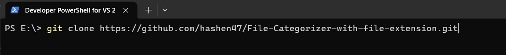
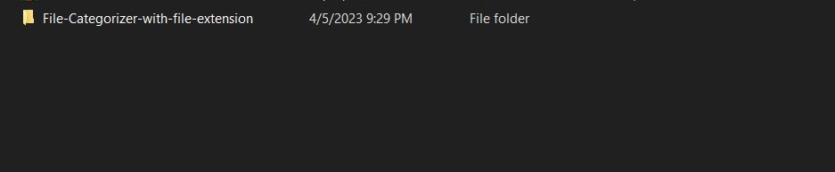
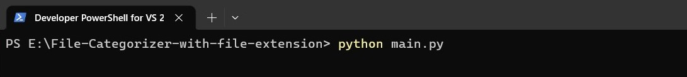
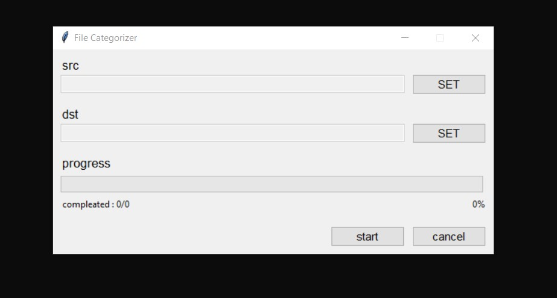
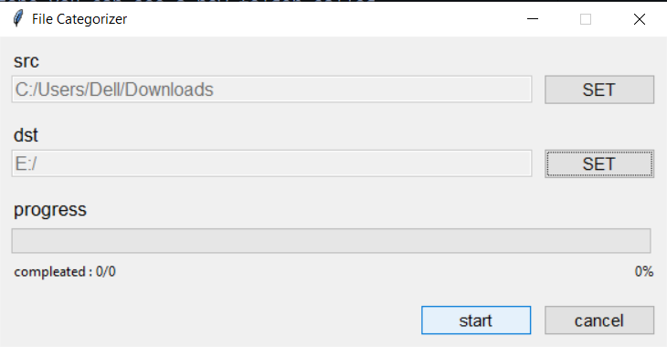
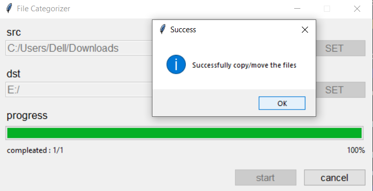
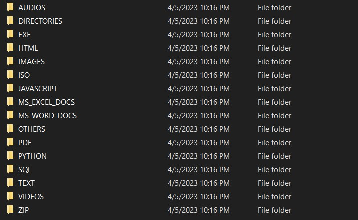

# FILE CATEGORIZER

This project purpose is to categorize your file according to file's extension and copy them to another selected folder. Imagine You have a lots of files in your Downloads folder and how hard to categorize them. So this project help you to do that.

## Dependencies

This programme need python to run, so first you should install python to your local machine. you can download python [here](https://www.python.org/downloads/)

## Installation

first you should clone the repo. go to the folder that you want to store this repo. then openup your terminal and paste below command and press Enter key.

```git clone https://github.com/hashen47/File-Categorizer-with-file-extension.git```



## How to use

- After cloning process is done you can see a new folder called **File-Categorizer-with-file-extension**

    

- Open up that folder and then open up your terminal in that folder. then type `python main.py` or `python3 main.py` command on your terminal and then press Enter key.

    

- Then you can see a window like this.

    

- Then you should set the src folder and dst folder, src folder mean the folder include files that you want to categorize, dst folder mean the folder that you want to categorize that files and store them.

- After set the src and dst, click the start button. then you can see programme start to categorize and copy them. you can also see the progress of the process.

    

- After categorize files and copy all of them to dst folder programme give your a notification.

    

- Then go to the destination folder and you can see a new folder called **OUTPUT** is created.

    

- In that folder's sub folders contains you files.

    

- After process is done, click cancel button to close the programme.

    

## Limits

- This programme not replace any file, only copy if that file is not exists in the sub folders(folders that in the OUTPUT FOLDER).

- If their is no record to some extension (in data list in core/dirs_and_exts.py) all files which contain that extension copy to the OUTPUT/OTHERS folder, if you want to add more extension to categorize, edit the data list in core/dirs_and_exts.py file

## Support

- Give a start for this project :yum: and follow :cowboy_hat_face: :partying_face: